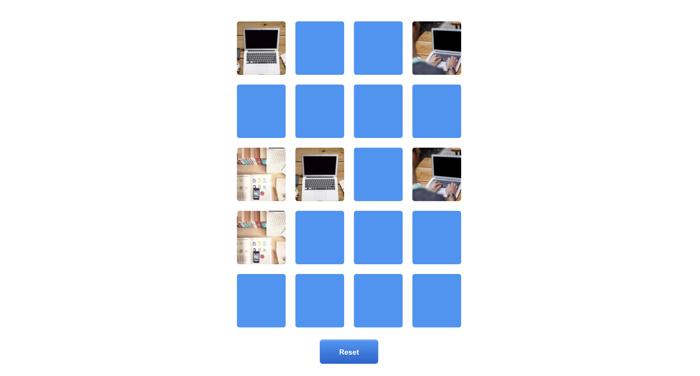

# Memory Game

This project was bootstrapped with [Create React App](https://github.com/facebook/create-react-app).

## Getting Started

    npm install

After all packages are installed, run the following command.

    npm run start

Runs the app in the development mode.\
Open [http://localhost:3000](http://localhost:3000) to view it in the browser.

The page will reload if you make edits.\
You will also see any lint errors in the console.

## Preview

This is a memory game with ​20 ​cards and a ​4x5 ​layout. Cards are to be ​shuffled ​on load or reset.
A ​restart button​ should allow the player to reset the game. Have fun ~

Matched cards will remain and stay flipped.

